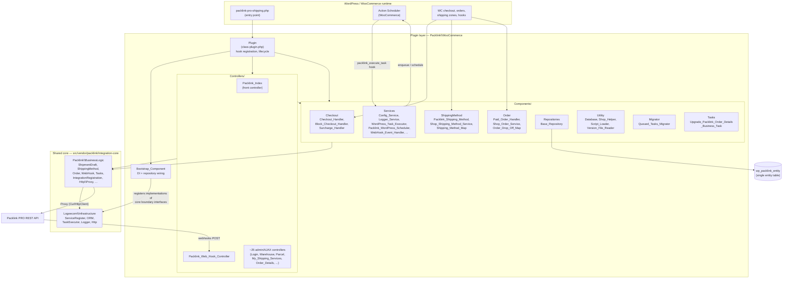
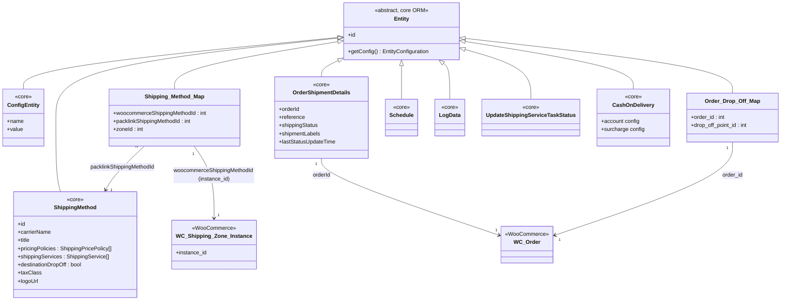
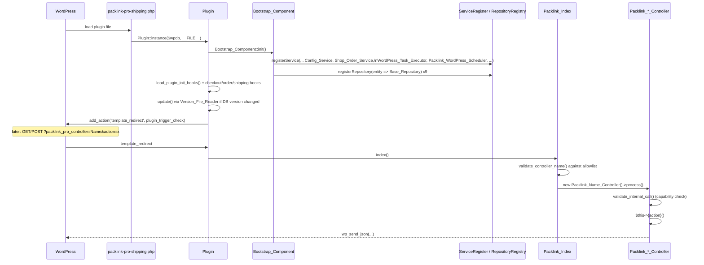
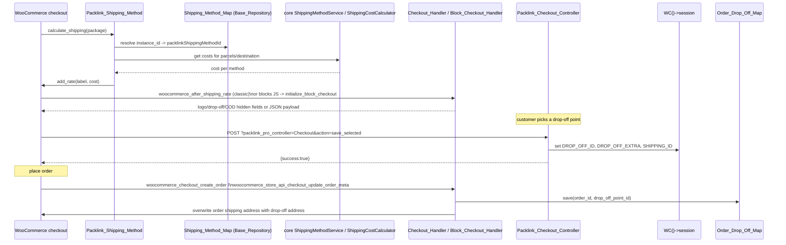
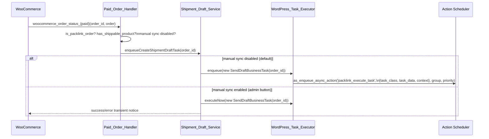
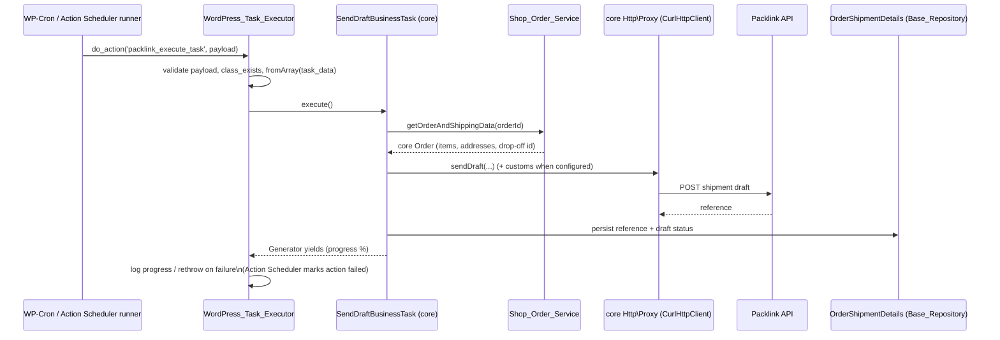
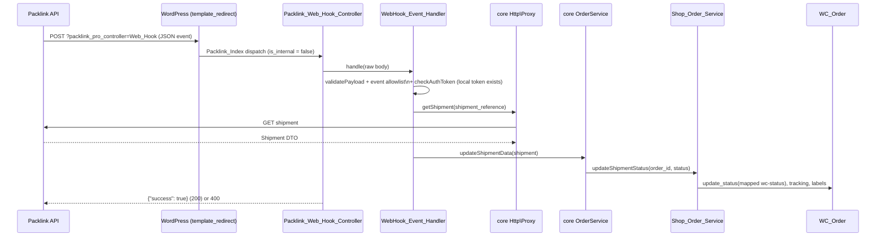

# DESIGN.md — Packlink PRO Shipping for WooCommerce

## 1. Purpose

Packlink PRO Shipping is a WordPress/WooCommerce plugin that connects a WooCommerce store to the Packlink PRO shipping platform. It lets merchants offer Packlink carrier services as WooCommerce shipping methods (with pricing policies, drop-off points, and cash-on-delivery surcharges), automatically creates Packlink shipment drafts when orders are paid, receives shipment/label/tracking updates from Packlink via webhooks, and exposes an admin SPA for onboarding, configuration, and shipping-service management. All platform-agnostic business logic lives in the shared library `packlink/integration-core` (`src/vendor/packlink/integration-core`); this plugin is the WooCommerce wrapper that wires the core via bootstrap/DI and implements its platform-boundary interfaces.

## 2. Architecture overview

Three layers with a strict downward dependency direction: WordPress/WooCommerce glue (entry point, hooks, controllers) → plugin components (`Packlink\WooCommerce\Components\*`) → shared core (`Packlink\BusinessLogic\*` on top of `Logeecom\Infrastructure\*`). The core never references WordPress; it reaches the platform only through interfaces (`ShopOrderService`, `ShopShippingMethodService`, `Configuration`, `ShopLoggerAdapter`, `TaskExecutorInterface`, `SchedulerInterface`, `HttpClient`, …) that the plugin implements and registers in `ServiceRegister` inside `Bootstrap_Component`.

## 3. Key components

- **`Plugin`** (`src/class-plugin.php`) — singleton created by the entry point; registers every WordPress hook: activation/deactivation/uninstall, DB install/upgrade (via `Database` + `Version_File_Reader` over `src/upgrade/upgrade-*.php`), HPOS compatibility declaration, admin menu, shipping-method/zone hooks, order hooks, checkout hooks (classic + blocks), storefront tracking link, `updated_option` listener that re-registers the integration URL when `home`/`siteurl` changes, and the front-controller query var `packlink_pro_controller`. Collaborators: `Bootstrap_Component`, `Shop_Helper`, `Shipping_Method_Helper`, all controllers/handlers.
- **`Bootstrap_Component`** (`src/Components/class-bootstrap-component.php`) — extends core `Packlink\BusinessLogic\BootstrapComponent`; overrides `initServices()` to register WooCommerce implementations in `ServiceRegister` (`Config_Service`, `Logger_Service`, `CurlHttpClient`, `Shop_Order_Service`, `Shop_Shipping_Method_Service`, `WordPress_Task_Executor`, `Packlink_WordPress_Scheduler`, `WordPress_Task_Metadata_Provider`, `Integration_Registration_Data_Provider`, `Integration_Reset_Service`, `Registration_Info_Service`, `System_Info_Service`, `Warehouse_Country_Service`, `Offline_Payments_Service`, `Label_Merge_Service`, `Shipment_Draft_Service`, `NativeSerializer`, `FileResolverService`, `PacklinkConfigurationService` brand) and `initRepositories()` to map every persisted entity to `Base_Repository`.
- **`Packlink_Index`** (`src/Controllers/class-packlink-index.php`) — front controller; resolves `?packlink_pro_controller=<Name>` against a hard-coded allowlist and dispatches to `Packlink_<Name>_Controller::process()`. `Packlink_Base_Controller` enforces auth for internal calls (`administrator`, or `manage_woocommerce` for `$SHOP_MANAGER_ALLOWED_ACTIONS`) and provides JSON response helpers.
- **`Base_Repository`** (`src/Components/Repositories/class-base-repository.php`) — implements core `RepositoryInterface` over the single `{prefix}packlink_entity` table (`type`, `index_1..index_8`, `data` LONGTEXT); translates core `QueryFilter`s using `IndexHelper` field→index mapping. `Database` (`src/Components/Utility/class-database.php`) owns install/upgrade/uninstall of the table.
- **`WordPress_Task_Executor`** (`src/Components/Services/class-wordpress-task-executor.php`) — implements core `TaskExecutorInterface` on top of WooCommerce Action Scheduler: `enqueue()`/`scheduleDelayed()` serialize a `BusinessTask` (`toArray()` + class name) into an `as_enqueue_async_action`/`as_schedule_single_action` payload on hook `packlink_execute_task`; `executeTaskCallback()` rehydrates via `fromArray()` and runs it, iterating `Generator` yields as progress/keep-alive logging; `executeNow()` runs a task synchronously (manual sync mode).
- **`Packlink_WordPress_Scheduler`** (`src/Components/Services/class-packlink-wordpress-scheduler.php`) — implements core `SchedulerInterface`; computes next weekly/daily/hourly timestamps from `ScheduleConfig` and registers recurring/single Action Scheduler actions on the same hook, with de-duplication via `as_next_scheduled_action`.
- **`Shipment_Draft_Service`** (`src/Components/Services/class-shipment-draft-service.php`) — extends core `ShipmentDraftService`; when manual sync is off it defers to the core (task enqueue), when on it runs `SendDraftBusinessTask` immediately via `executeNow()` and reports through admin transient notices.
- **`Paid_Order_Handler`** (`src/Components/Order/class-paid-order-handler.php`) — hooked to every `woocommerce_order_status_<paid-status>`; if the order used a Packlink method and has a shippable product, asks `ShipmentDraftServiceInterface` to enqueue the draft task.
- **`Shop_Order_Service`** (`src/Components/Order/class-shop-order-service.php`) — implements core `ShopOrderService`; maps `WC_Order` to the core `Order` object (items, addresses, drop-off id from `Order_Drop_Off_Map`) and applies shipment-status → WC order-status transitions using the configured mappings.
- **`Packlink_Shipping_Method`** (`src/Components/ShippingMethod/class-packlink-shipping-method.php`) — extends `WC_Shipping_Method` (id `packlink_shipping_method`); `calculate_shipping()` resolves the mapped core `ShippingMethod` through `Shipping_Method_Map` and prices the package via core `ShippingMethodService`/`ShippingCostCalculator`, plus shipping-class surcharges.
- **`Shop_Shipping_Method_Service`** (`src/Components/ShippingMethod/class-shop-shipping-method-service.php`) — implements core `ShopShippingMethodService`; creates/updates/deletes `Packlink_Shipping_Method` instances in `WC_Shipping_Zones` when methods are activated in the admin SPA, maintaining `Shipping_Method_Map` rows per zone.
- **Checkout handlers** (`src/Components/Checkout/`) — `Checkout_Handler` (classic checkout: hidden inputs per rate, drop-off picker view, drop-off validation on `woocommerce_checkout_process`, address substitution on order create), `Block_Checkout_Handler` (blocks checkout: JSON init payload with method details/drop-off locations/COD fee, footer drop-off markup, `woocommerce_store_api_checkout_update_order_meta` persistence), `Surcharge_Handler` (COD surcharge on both checkouts), `Checkout_Helper`. `Packlink_Checkout_Controller` is the public AJAX endpoint that stores the selected drop-off point in the WC session.
- **`WebHook_Event_Handler`** (`src/Components/Services/class-webhook-event-handler.php`) — extends core `WebHookEventHandler`; validates payload/event allowlist and delegates to core, which fetches the shipment via `Proxy` and updates order data through `OrderService`/`Shop_Order_Service`.
- **`Queued_Tasks_Migrator`** (`src/Components/Migrator/ActionSchedulerMigrator/class-queued-tasks-migrator.php`, invoked by `src/upgrade/upgrade-4.0.0.php`) — one-time migration of legacy core `QueueItem` rows (pre-4.0 queue) into Action Scheduler actions, draft-status migration, weekly `UpdateShippingServicesBusinessTask` scheduling, and legacy cleanup.

## 4. Domain model

All entities below extend `Logeecom\Infrastructure\ORM\Entity` and are persisted as rows of `{prefix}packlink_entity`, discriminated by `type` and queried through `index_1..index_8` columns.

## 5. Key flows

### 5.1 Plugin bootstrap and admin/AJAX request routing

### 5.2 Checkout shipping rate calculation and drop-off selection (classic + blocks)

### 5.3 Paid order → shipment draft creation

### 5.4 Async task execution (Action Scheduler runner)

### 5.5 Webhook handling (shipment status / labels / tracking)

## 6. Module map

| Module | Responsibility | Key entry points |
|---|---|---|
| Entry point | Plugin header, polyfills, autoloaders, singleton boot | `src/packlink-pro-shipping.php`, `src/inc/autoload.php`, `src/inc/php8-polyfills.php` |
| Plugin wiring | All WP hook registration, lifecycle (activate/deactivate/uninstall/update), multisite | `src/class-plugin.php` |
| Bootstrap/DI | Service + repository registration into core registries | `src/Components/class-bootstrap-component.php` |
| `Components/Checkout` | Classic and blocks checkout UX: drop-off picker, COD surcharge, rate metadata | `class-checkout-handler.php`, `class-block-checkout-handler.php`, `class-surcharge-handler.php`, `class-checkout-helper.php` |
| `Components/Customs` | Customs data capture: product HS code / country-of-origin fields, customer-profile tax ID / VAT fields, default customs-mapping seeding | `class-customs-handler.php` |
| `Components/Order` | Order boundary: paid-order trigger, WC↔core order mapping, drop-off persistence | `class-paid-order-handler.php`, `class-shop-order-service.php`, `class-order-drop-off-map.php` |
| `Components/ShippingMethod` | WC shipping method, zone/instance management, WC↔Packlink method mapping | `class-packlink-shipping-method.php`, `class-shop-shipping-method-service.php`, `class-shipping-method-map.php`, `class-shipping-method-helper.php`, `includes/settings-packlink-shipping.php` |
| `Components/Services` | Implementations of core service interfaces: config, logging, task execution, scheduling, webhook, drafts, labels, system/registration info, offline payments | `class-config-service.php`, `class-logger-service.php`, `class-wordpress-task-executor.php`, `class-packlink-wordpress-scheduler.php`, `class-wordpress-task-metadata-provider.php`, `class-wordpress-task-status-provider.php`, `class-webhook-event-handler.php`, `class-shipment-draft-service.php`, `class-order-service.php`, `class-label-merge-service.php`, `class-offline-payments-service.php`, `class-registration-info-service.php`, `class-system-info-service.php`, `class-warehouse-country-service.php` |
| `Components/IntegrationRegistration` | Integration identity/webhook URL registration with Packlink; disconnect/reset | `class-integration-registration-data-provider.php`, `class-integration-reset-service.php` |
| `Components/Repositories` | Core-ORM repository over the single entity table | `class-base-repository.php` |
| `Components/Migrator` | 4.0.0 migration of legacy core queue to Action Scheduler | `ActionSchedulerMigrator/class-queued-tasks-migrator.php` |
| `Components/Tasks` | Plugin-specific business task (order-details backfill) | `BusinessTasks/class-upgrade-packlink-order-details-business-task.php` |
| `Components/Utility` | DB installer, shop/plugin helpers, script loading, upgrade-file runner, debug | `class-database.php`, `class-shop-helper.php`, `class-script-loader.php`, `class-version-file-reader.php`, `class-actions-delete.php`, `class-debug-helper.php` |
| `Controllers/` | Front controller + ~30 admin/AJAX/public endpoints (allowlisted names) | `class-packlink-index.php`, `class-packlink-base-controller.php`, `class-packlink-frontend-controller.php`, `class-packlink-web-hook-controller.php`, `class-packlink-checkout-controller.php`, `class-packlink-order-details-controller.php`, `class-packlink-order-overview-controller.php`, … |
| `upgrade/` | Versioned upgrade scripts executed by `Version_File_Reader` | `src/upgrade/upgrade-4.0.0.php` and earlier |
| `resources/` | Admin SPA views/JS/CSS, checkout JS, country/brand JSON | `resources/views/index.php`, `resources/js/packlink-block-checkout.js`, `resources/countries/` |
| Shared core | Platform-agnostic business logic + infrastructure (ORM, DI, HTTP, tasks) | `src/vendor/packlink/integration-core/src/BusinessLogic/`, `.../Infrastructure/` |
| `Lib/` | Build-time resource copying from core into plugin resources | `src/Lib/class-resource-copier.php` |

## 7. Key patterns & conventions

- **DI/wiring**: no container framework; the core `Logeecom\Infrastructure\ServiceRegister` holds lazy factories keyed by interface `CLASS_NAME` constants. `Bootstrap_Component::initServices()` must register platform implementations *around* `parent::initServices()` (some registrations, e.g. `IntegrationRegistrationDataProviderInterface`, must precede the parent because core factories consume them). Repositories are registered per entity class in `RepositoryRegistry` in `initRepositories()`. New services/entities are wired only there.
- **Persistence**: single generic table `{prefix}packlink_entity` (created by `Database::install()`); entities serialize to the `data` column, queryable fields are projected into `index_1..index_8` via each entity's `getConfig()`/`IndexMap`. Never add per-feature tables; add an entity + index map + repository registration instead.
- **Boundary interfaces**: the plugin never reimplements core logic — it implements/extends core contracts (`Configuration` → `Config_Service`, `ShopOrderService` → `Shop_Order_Service`, `ShopShippingMethodService` → `Shop_Shipping_Method_Service`, `TaskExecutorInterface` → `WordPress_Task_Executor`, `SchedulerInterface` → `Packlink_WordPress_Scheduler`, `ShopLoggerAdapter` → `Logger_Service`, `WebHookEventHandler` → `WebHook_Event_Handler`, `ShipmentDraftService` → `Shipment_Draft_Service`, `AbstractIntegrationDataProvider` → `Integration_Registration_Data_Provider`). Direct WordPress/WooCommerce API calls belong only in the plugin layer.
- **Async model (since 4.0.0)**: business work is expressed as core `BusinessTask` implementations (`toArray()`/`fromArray()` serializable, optionally `Generator`-yielding for progress). Execution/scheduling is delegated to WooCommerce Action Scheduler under the single hook `packlink_execute_task`, grouped by queue name and priority-mapped 0–100 → 0–10. The legacy core `TaskExecution` queue still exists in the vendor library but is no longer the runtime path; `Queued_Tasks_Migrator` moved pending items over.
- **Controller routing**: public URL surface is exactly one query var (`packlink_pro_controller`); controller names must be added to the allowlist in `Packlink_Index::validate_controller_name()`. Controllers are thin — auth check, param parsing, delegate to core controllers/services, JSON out via `wp_send_json`. External endpoints set `$is_internal = false` explicitly.
- **Naming**: WordPress file convention `class-<kebab-name>.php` with `Snake_Case` class names under `Packlink\WooCommerce\…`, resolved by the custom autoloader `src/inc/autoload.php` (namespace segment ↔ directory, underscores ↔ hyphens). Core vendor code follows PSR-4/StudlyCase via Composer autoload. Breaking either convention breaks class loading.
- **Admin messaging**: transients `packlink-pro-messages`, `packlink-pro-success-messages`, `packlink-pro-error-messages` rendered by `Plugin::admin_*` notice hooks.

## 8. External boundaries

- **Packlink PRO REST API** — all outbound calls go through core `Packlink\BusinessLogic\Http\Proxy` using the registered `CurlHttpClient`; authenticated with the merchant API token stored via `Config_Service`. Consumers: draft creation, shipment/label/tracking fetch, shipping-service sync, registration, analytics, subscription/COD endpoints.
- **Inbound webhooks** — `POST {site}/?packlink_pro_controller=Web_Hook`; events `shipment.carrier.success`, `shipment.delivered`, `shipment.carrier.delivered`, `shipment.label.ready`, `shipment.tracking.update` are processed; payload data is not trusted directly — the shipment is re-fetched from the API by reference. The webhook URL is (re)registered with Packlink by `IntegrationRegistrationService`, including on `home`/`siteurl` option changes (`Plugin::update_home_url`).
- **Integration registration endpoint** — `Packlink_Integration_Registration_Webhook_Controller` / `Packlink_Integration_Status_Controller` support Packlink-side activation/deactivation of the integration.
- **Action Scheduler (WooCommerce)** — the async queue; requires WooCommerce active and WP-Cron (or a real cron hitting it) to run; all Packlink jobs share hook `packlink_execute_task`. Uninstall removes pending actions via `Actions_Delete::delete_packlink_scheduled_actions`.
- **WooCommerce/WordPress surface** — shipping method registration (`woocommerce_shipping_methods`), zone lifecycle hooks, checkout hooks (classic and Store API/blocks: `woocommerce_store_api_checkout_update_order_from_request`, `woocommerce_store_api_checkout_update_order_meta`, `woocommerce_blocks_checkout_enqueue_data`), paid-order status hooks, orders list/HPOS `wc-orders` screens, payment-gateway filtering for COD (`woocommerce_available_payment_gateways`).

## 9. Known constraints

- **PHP floor 7.0** (`composer.json` `"php": ">=7.0"`, `readme.txt` `Requires PHP: 7.0`) — vendor core and most plugin code stay array()/pre-7.1 compatible; `src/inc/php8-polyfills.php` covers PHP 8 runtime differences. Newer files (`WordPress_Task_Executor`, `Packlink_WordPress_Scheduler`) already use scalar type hints (7.0+) and `??`; features beyond 7.0 must not be introduced.
- **Platform floor**: WordPress 4.7+ (`Requires at least: 4.7`, tested 6.9), WooCommerce 3.0.0+ (`WC requires at least: 3.0.0`, tested 10.3.6). HPOS (custom order tables) compatibility is declared and both legacy `shop_order` and `wc-orders` screens are handled. Multisite (network activation, per-site install/uninstall) is supported. cURL is a hard activation requirement.
- **Single-table ORM**: the `packlink_entity` EAV-style table trades relational integrity and SQL expressiveness for core portability; queries are limited to eight indexed columns per entity type. `Base_Repository` builds SQL by string interpolation of index values (escaped in `apply_query_filter` internals but not parameterized) — a deliberate legacy pattern of the shared ORM, not to be extended to new raw queries.
- **Webhook authentication is weak by design of the platform**: `WebHookEventHandler::checkAuthToken()` only verifies a local auth token exists; there is no request signature verification — mitigated by re-fetching shipment data from the API instead of trusting the payload.
- **Dual task systems in the codebase**: the vendor core still ships `Infrastructure\TaskExecution` (QueueItem/TaskRunner), but the plugin's runtime path is exclusively the Action Scheduler executor/scheduler; `Schedule` entities and the migrator remain for backward compatibility. New async work must use `BusinessTask` + `TaskExecutorInterface`, never the legacy queue.
- **Async reliability depends on WP-Cron**: on low-traffic sites Action Scheduler actions (draft creation, weekly service updates) run late unless a real cron pings the site.
- **`Plugin::initialize()` runs on every request** (hook registration plus a DB-version check) and the update path iterates all sites on multisite — upgrade scripts must stay idempotent and cheap.
